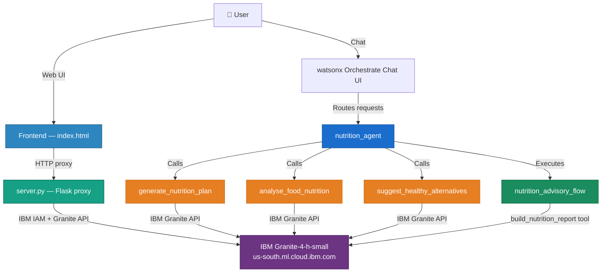
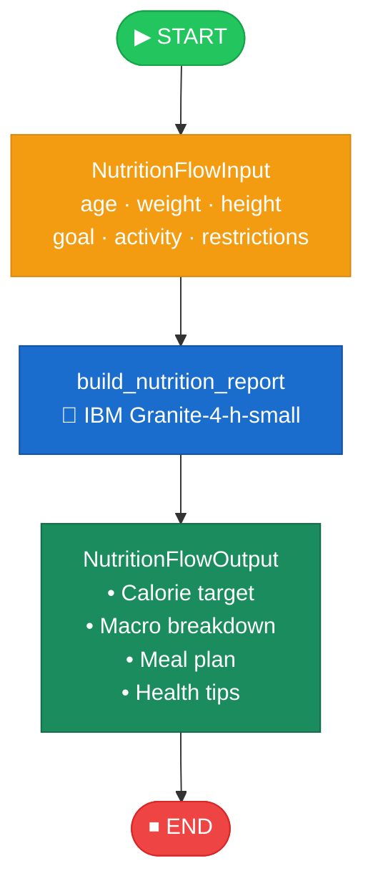

<div align="center">


# 🥗 Nutrition Advisor Agent

**A personalised AI nutrition advisor powered by IBM Granite-4-h-small and deployed on IBM watsonx Orchestrate.**  
Get tailored nutrition plans, deep food analysis, and smart healthy-swap recommendations — all from a single conversational agent.

[Features](#-features) · [Architecture](#-architecture) · [Project Structure](#-project-structure) · [Setup](#-environment-setup) · [Usage](#-usage) · [Tools](#-tools)

</div>

---

## ✨ Features

| 🎯 Feature | Description |
|---|---|
| **Personalised Nutrition Plans** | Full daily meal plan built around your age, weight, height, goal, and activity level |
| **Food Analysis** | Calories, macros, micros, and a health rating for any food or meal |
| **Healthy Swaps** | Smart food-substitution suggestions aligned to your dietary preferences |
| **End-to-End Report Flow** | One-shot flow from user profile → IBM Granite → complete formatted nutrition report |
| **Web Chat UI** | Standalone browser-based chat powered by a lightweight Flask proxy |
| **watsonx Orchestrate Native** | Import directly into Orchestrate for a production-ready AI agent experience |

---

## 🏗️ Architecture



### Nutrition Advisory Flow



---

## 📁 Project Structure

```
nutrition_agent/
├── 📄 __init__.py
├── 🚀 main_flow.py              # Programmatic flow test script
├── 🌐 server.py                 # Flask proxy (serves UI + proxies API calls)
├── 🔧 import-all.sh             # CLI import script for watsonx Orchestrate
├── 📦 requirements.txt          # Python dependencies
├── 🔑 .env.example              # Credentials template (copy → .env, never commit .env)
├── 📖 README.md
│
├── tools/
│   ├── __init__.py
│   ├── 🍎 nutrition_tools.py    # Core tools: generate plan, analyse food, suggest swaps
│   └── 🔄 nutrition_flow.py     # Nutrition advisory flow definition
│
├── agents/
│   └── 🤖 nutrition_agent.yaml  # Agent configuration (LLM, tools, starter prompts)
│
├── generated/                   # Compiled flow specs (auto-generated, git-ignored)
│
└── frontend/
    └── 💬 index.html            # Standalone web chat UI
```

---

## 🛠️ Tools

| Tool | Input | What it does |
|------|-------|-------------|
| `generate_nutrition_plan` | age, weight, height, goal, activity, restrictions | Generates a full personalised daily nutrition plan with meals and macros |
| `analyse_food_nutrition` | food name / description | Returns calories, protein, carbs, fat, micros, and a health rating |
| `suggest_healthy_alternatives` | food item, dietary preferences | Recommends healthier substitutes that still match taste profile |
| `nutrition_advisory_flow` | complete user profile | End-to-end flow: profile → Granite → formatted comprehensive report |

---

## ⚙️ Configuration

| Setting | Value |
|---------|-------|
| **Model** | `ibm/granite-4-h-small` |
| **Inference Endpoint** | `https://us-south.ml.cloud.ibm.com/ml/v1/text/generation?version=2023-05-29` |
| **Agent LLM** | `groq/openai/gpt-oss-120b` |
| **Agent Style** | `react_core` |

> 🔒 **Credentials are never stored in code.** All secrets are loaded from environment variables. See [Environment Setup](#-environment-setup) below.

---

## 🔑 Environment Setup

> ⚠️ **Never commit your `.env` file or real credentials to version control.**

### Step 1 — Copy the example file

```bash
cp .env.example .env
```

### Step 2 — Fill in your credentials

```env
# Required
WATSONX_API_KEY=your_ibm_cloud_api_key_here
WATSONX_PROJECT_ID=your_watsonx_project_id_here

# Optional — sensible defaults are used if omitted
WATSONX_URL=https://us-south.ml.cloud.ibm.com/ml/v1/text/generation?version=2023-05-29
MODEL_ID=ibm/granite-4-h-small
```

### Where to find each credential

| Variable | Where to get it |
|---|---|
| `WATSONX_API_KEY` | [IBM Cloud → IAM → API keys](https://cloud.ibm.com/iam/apikeys) |
| `WATSONX_PROJECT_ID` | watsonx.ai project → **Manage** tab → Project ID |
| `WATSONX_URL` | Regional endpoint — default is `us-south`; change if your project is in another region |
| `MODEL_ID` | Granite model to use — default is `ibm/granite-4-h-small` |

---

## 🚀 Usage

### Option 1 — Web UI _(recommended for quick testing)_

```bash
# 1. Install dependencies
pip install -r requirements.txt

# 2. Configure credentials
cp .env.example .env
# Edit .env with your IBM credentials

# 3. Start the Flask proxy server
python server.py

# 4. Open your browser at:
#    http://localhost:5000
```

### Option 2 — Import to watsonx Orchestrate

```bash
# Log in to the Orchestrate CLI first, then:
chmod +x import-all.sh
./import-all.sh

# Start a chat session and select 'nutrition_agent'
orchestrate chat start
```

### Option 3 — Programmatic flow test

```bash
export PYTHONPATH=/path/to/adk/src:/path/to/adk
python main_flow.py
```

---

## 📦 Dependencies

```bash
pip install -r requirements.txt
```

| Package | Purpose |
|---------|---------|
| `flask` | Lightweight web server and API proxy backend |
| `flask-cors` | Cross-origin request handling for the browser UI |
| `requests` | HTTP calls to the IBM watsonx Inference API |
| `pydantic` | Schema validation for tool inputs and flow I/O |
| `python-dotenv` | Loads `.env` credentials at runtime |
| `ibm-watsonx-orchestrate` | ADK — tools, flows, and agent authoring |

---

## 💬 Starter Prompts

The agent ships with four ready-to-use conversation starters:

> 🟢 **"Create my nutrition plan"** — Generate a full personalised daily plan  
> 🔵 **"Analyse a food item"** — Get a detailed nutritional breakdown of any meal  
> 🟡 **"Healthy Swaps"** — Discover healthier alternatives to your favourite foods  
> 🟣 **"Full Report"** — Get a comprehensive nutrition report with a complete meal plan  

---

## 🔐 Security

- All IBM credentials are loaded exclusively from **environment variables** — zero hardcoding.
- The Flask server acts as a **secure proxy** — API keys are never exposed to the browser.
- `.env` is listed in `.gitignore` and will **never** be committed to source control.
- Only `.env.example` (with safe placeholder values) is tracked by git.

---

## 📄 License

This project is provided as-is for **educational and demonstration purposes**.  
> ⚕️ Always consult a qualified healthcare professional for personalised medical or dietary advice.

---

<div align="center">
  <sub>Built with ❤️ using <strong>IBM watsonx Orchestrate</strong> · <strong>IBM Granite-4-h-small</strong> · <strong>Python</strong></sub>
</div>
